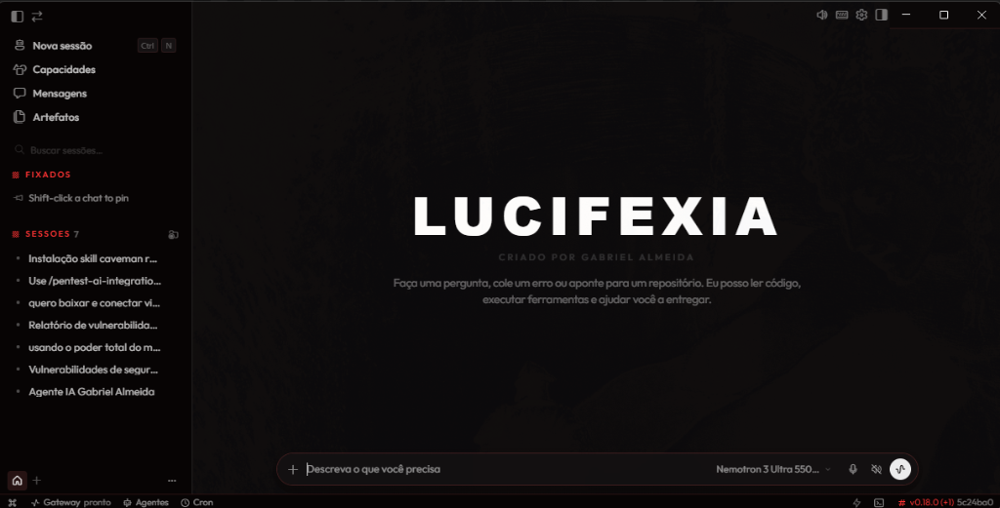

<p align="center">
  
</p>

# Lucifex Agent ☤
<p align="center">
  <a href="https://github.com/Gabrie-yx/lucifexia">Lucifex Agent</a> | <a href="https://github.com/Gabrie-yx/lucifexia">Lucifex Desktop</a>
</p>
<p align="center">
  <a href="https://github.com/Gabrie-yx/lucifexia/blob/main/LICENSE"></a>
  <a href="https://github.com/Gabrie-yx/lucifexia"></a>
</p>

**O agente de IA auto-melhorável projetado para ser executado de forma local e independente.** É o único agente com um loop de aprendizado integrado: ele cria habilidades a partir da experiência, melhora-as durante o uso, gerencia seu próprio conhecimento, busca em conversas passadas e constrói um perfil profundo de suas preferências entre as sessões. Pode ser executado em sua máquina local, em uma VPS de $5 ou em servidores na nuvem.

Use qualquer modelo que desejar — **Ollama** (processamento 100% local e privado), OpenRouter, OpenAI, seu próprio endpoint personalizado e muitos outros. Mude facilmente usando o comando `lucifex model` — sem alterações de código, sem dependências de fornecedores.

<table>
<tr><td><b>Uma interface de terminal real</b></td><td>TUI completa com edição de várias linhas, preenchimento automático de comandos de barra (/), histórico de conversas e saída em tempo real das ferramentas.</td></tr>
<tr><td><b>Integração com Mensageiros</b></td><td>Telegram, Discord, Slack, WhatsApp e CLI — tudo a partir de um único processo de gateway. Transcrição de áudio e continuidade de conversas entre plataformas.</td></tr>
<tr><td><b>Loop de Aprendizado Fechado</b></td><td>Memória com curadoria própria. Criação autônoma de habilidades após tarefas complexas. Habilidades que melhoram sozinhas. Busca textual nas sessões para lembrança rápida entre conversas.</td></tr>
<tr><td><b>Automações Agendadas</b></td><td>Agendador cron integrado para envio de relatórios diários, backups e auditorias em linguagem natural para qualquer mensageiro.</td></tr>
<tr><td><b>Subagentes e Paralelismo</b></td><td>Inicie subagentes isolados para fluxos de trabalho paralelos ou escreva scripts Python que executam ferramentas via RPC.</td></tr>
<tr><td><b>Roda em qualquer lugar</b></td><td>Compatível com execução local, Docker, SSH, Singularity e provedores de nuvem para economizar recursos quando ocioso.</td></tr>
</table>

---

## Instalação Rápida

### Linux, macOS, WSL2, Termux

```bash
curl -fsSL https://raw.githubusercontent.com/Gabrie-yx/lucifexia/main/scripts/install.sh | bash
```

### Windows (Nativo via PowerShell)

Execute este comando no seu PowerShell:

```powershell
iex (irm https://raw.githubusercontent.com/Gabrie-yx/lucifexia/main/scripts/install.ps1)
```

O instalador cuida de tudo: uv, Python 3.11, Node.js, ripgrep, ffmpeg e um **Git Bash portátil** isolado do sistema para executar comandos de terminal com segurança.

Após a instalação:
```bash
lucifex              # Inicia o chat no terminal!
```

---

## Primeiros Passos

```bash
lucifex              # CLI Interativa — comece a conversar
lucifex model        # Escolha seu provedor e modelo de IA
lucifex tools        # Configure quais ferramentas estão ativas
lucifex config set   # Altere valores de configuração individuais
lucifex gateway      # Inicie o gateway de mensagens (Telegram, Discord, etc.)
lucifex setup        # Assistente de configuração completa inicial
lucifex update       # Atualize o Lucifex para a versão mais recente
lucifex doctor       # Faça um diagnóstico do sistema
```

---

## Execução Local com Ollama — LUCIFEXIA

O Lucifexia foi projetado para funcionar de forma independente e local. Utilizando o **Ollama**, você pode rodar o modelo `ULTRON-V2` ou `lucifexia` diretamente na sua máquina, sem depender de chaves de API pagas ou assinaturas na nuvem:

- **Modelos Locais** — Rode modelos abertos com total privacidade e sem latência de rede.
- **Configuração Integrada** — O instalador configura o Ollama e baixa o modelo automaticamente no primeiro início.

---

## CLI vs Mensageiros — Referência Rápida

| Ação | CLI / Terminal | Plataformas de Mensagem |
| --- | --- | --- |
| Iniciar conversa | `lucifex` | Inicie o gateway e envie uma mensagem para o bot |
| Nova conversa limpa | `/new` ou `/reset` | `/new` ou `/reset` |
| Mudar de modelo | `/model [provedor:modelo]` | `/model [provedor:modelo]` |
| Definir personalidade | `/personality [nome]` | `/personality [nome]` |
| Tentar de novo / Desfazer | `/retry`, `/undo` | `/retry`, `/undo` |
| Interromper execução | `Ctrl+C` ou nova mensagem | `/stop` ou nova mensagem |

---

## Comunidade & Suporte

- 🐛 [Relatar Bugs / Issues](https://github.com/Gabrie-yx/lucifexia/issues)

---

## Licença

MIT — veja o arquivo [LICENSE](LICENSE).

Criado para rodar localmente com Ollama e construído sob a licença de software livre.
