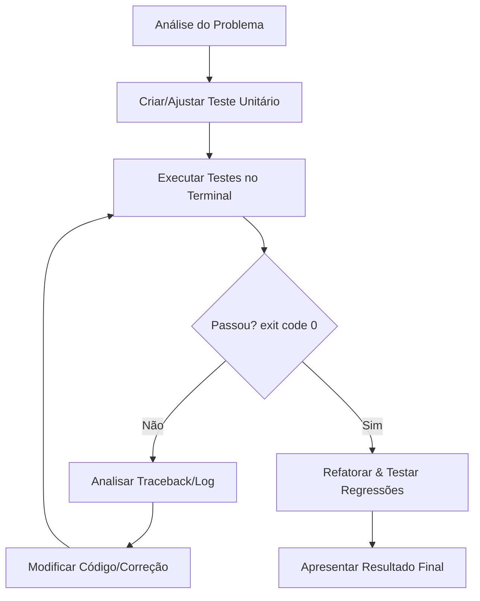

# Loop de Programação Autônoma e Autocorreção (Autonomous Self-Debugging)

Esta habilidade orienta o agente a realizar ciclos iterativos de desenvolvimento e depuração automática. O objetivo é escrever testes, executá-los em um subprocesso e corrigir erros de forma autônoma e silenciosa até obter sucesso absoluto.

## Quando Utilizar
- Ao implementar novas funções, classes ou módulos.
- Ao corrigir bugs em código existente.
- Quando o usuário solicitar uma tarefa complexa de programação que exija validação robusta.

## O Algoritmo de Depuração Autônoma

Siga rigorosamente estas etapas ao receber uma tarefa de programação:

### Passo 1: Análise e Mapeamento
- Identifique os arquivos de código de produção a serem criados ou editados.
- Identifique o local apropriado para os testes (geralmente dentro do diretório `tests/`).

### Passo 2: Criar ou Ajustar o Teste Unitário
- Escreva testes específicos usando `pytest` (ou `unittest` se for um script standalone).
- Certifique-se de testar casos de sucesso e também cenários com entradas inválidas ou limites (edge cases).

### Passo 3: Executar os Testes
- Rode os testes no terminal utilizando o ambiente virtual ativo (`.venv\Scripts\python.exe -m pytest <caminho_do_teste>`).
- Capture o código de retorno (exit code), o `stdout` e o `stderr`.

### Passo 4: Tratar Falhas (O Loop de Autocorreção)
- Se o teste falhar (exit code diferente de 0):
  1. Leia atentamente a stack trace/traceback.
  2. Localize o arquivo e a linha onde ocorreu o erro.
  3. Identifique o tipo de erro (ex: `AssertionError`, `TypeError`, `ModuleNotFoundError`, `NameError`, etc.).
  4. Realize a modificação no código-fonte necessária para corrigir o bug.
  5. Retorne ao **Passo 3** e reexecute o teste específico.
- **Limite de Segurança**: O loop deve rodar no máximo **10 vezes** para a mesma falha. Se exceder 10 tentativas sem sucesso, pare e solicite feedback ao usuário explicando o que já foi tentado.

### Passo 5: Refatoração e Regressão
- Uma vez que o teste específico passe (exit code 0):
  1. Limpe o código: remova trechos redundantes, renomeie variáveis para maior clareza e mantenha o estilo consistente com o resto do repositório.
  2. Execute a suite de testes completa do repositório para garantir que a sua alteração não causou nenhuma regressão em outras partes do sistema.

### Passo 6: Relatório de Trajetória
- Apresente o resultado final ao usuário e forneça um resumo amigável contendo:
  - O problema inicial identificado.
  - Quantas iterações o loop executou até passar nos testes.
  - Quais erros específicos foram encontrados e como você os solucionou.

## Boas Práticas e Regras de Segurança
- **Não adivinhe erros**: Sempre confie na saída real do terminal e do interpretador Python.
- **Isolamento de Ambiente**: Execute os testes preferencialmente usando o Python instalado no ambiente virtual do projeto (`.venv`), evitando misturar dependências globais do sistema operacional.
- **Silêncio durante o loop**: Evite perguntar coisas triviais ao usuário no meio do loop. Resolva os erros de sintaxe e lógica de forma autônoma. Só peça ajuda caso haja ambiguidade nas regras de negócio da tarefa.
